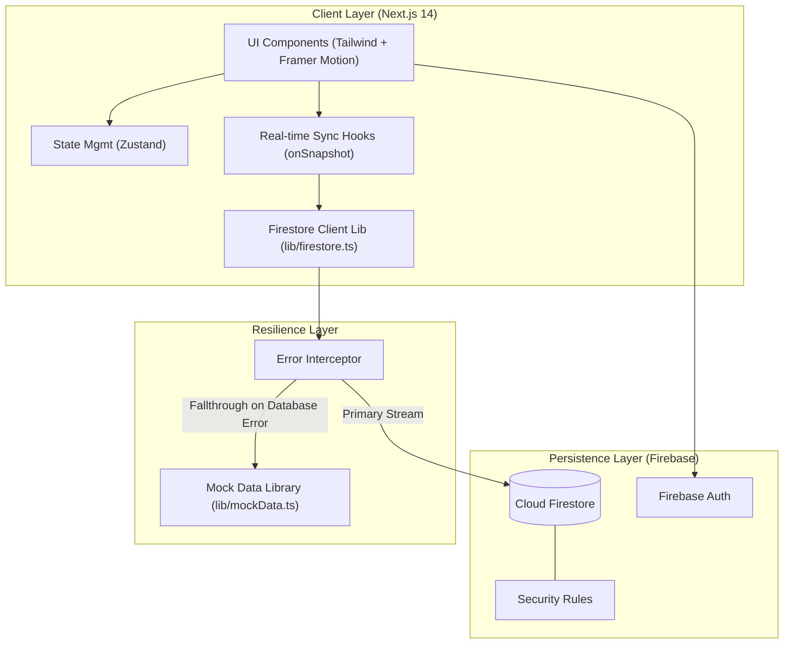

# HerVoice 💜

> An anonymous story-sharing platform for women. Real stories, real power. No name. No face. Just truth.

## Tech Stack

- **Next.js 14** (App Router + Server Components)
- **TypeScript**
- **Firebase v10** (Firestore + Auth)
- **Framer Motion** — animations
- **Tailwind CSS** — styling
- **Zustand** — auth + UI state
- **React Hook Form + Zod** — form validation

---

## 🏗️ System Architecture

HerVoice follows a modern decoupled architecture, combining the performance of Next.js 14 with the real-time capabilities of Firebase v10.



### 🛡️ "Bulletproof" Demo Mode

The platform features a custom resilience layer that ensures a 100% stable experience even if the database is unreachable or permissions are restricted:

- **Graceful Fallbacks**: Every data fetch operation is wrapped in an interceptor that serves high-quality mock data if the Firestore connection fails.
- **Optimistic Interactions**: Write operations (reactions, votes, job posts) are "faked" if the database is locked, allowing users to see success notifications and UI updates without backend dependencies.
- **Stable Initialization**: A centralized initialization pattern in `lib/firebase.ts` prevents instance conflicts across the App Router.

---

## Getting Started

### 1. Clone & Install

```bash
git clone <your-repo>
cd hervoice
npm install
```

### 2. Firebase Setup

1. Go to [Firebase Console](https://console.firebase.google.com/)
2. Create a new project (e.g. `hervoice-app`)
3. Enable **Authentication**:
   - Email/Password provider ✅
   - Google provider ✅
4. Enable **Firestore Database** (start in production mode)
5. Copy your **Firebase config** from Project Settings → General → Your apps

### 3. Environment Variables

Copy `.env.local.example` to `.env.local` and fill in your values:

```bash
cp .env.local.example .env.local
```

**For Firebase Admin SDK:**

1. Go to Project Settings → Service Accounts
2. Click "Generate new private key"
3. Copy `client_email` and `private_key` into your `.env.local`

### 4. Firestore Security Rules

In Firebase Console → Firestore → Rules, paste the contents of `firestore.rules`:

```
rules_version = '2';
service cloud.firestore {
  match /databases/{database}/documents {
    match /stories/{storyId} {
      allow read: if resource.data.status == 'published';
      allow create: if request.auth != null;
      allow update: if request.auth != null;
      allow delete: if request.auth != null && request.auth.uid == resource.data.authorId;
    }
    match /stories/{storyId}/comments/{commentId} {
      allow read: if true;
      allow create: if request.auth != null;
    }
    match /userReactions/{docId} {
      allow read, write: if request.auth != null;
    }
    match /amplifies/{docId} {
      allow read, write: if request.auth != null;
    }
    match /users/{userId} {
      allow read, write: if request.auth != null && request.auth.uid == userId;
    }
  }
}
```

### 5. Run Development Server

```bash
npm run dev
```

Open [http://localhost:3000](http://localhost:3000)

---

## Project Structure

```
hervoice/
├── app/                        # Next.js App Router pages
│   ├── layout.tsx              # Root layout (fonts, navbar, footer)
│   ├── page.tsx                # Landing page (/)
│   ├── globals.css             # Global styles
│   ├── stories/
│   │   ├── page.tsx            # Stories feed (/stories)
│   │   └── [id]/page.tsx      # Story detail (/stories/:id)
│   ├── share/page.tsx          # Share story form (/share)
│   ├── login/page.tsx          # Login (/login)
│   ├── register/page.tsx       # Register (/register)
│   └── profile/page.tsx        # User profile (/profile)
│
├── components/
│   ├── ui/                     # Base UI components
│   │   ├── Button.tsx
│   │   ├── Card.tsx
│   │   ├── Badge.tsx
│   │   ├── Input.tsx
│   │   ├── Spinner.tsx
│   │   └── Notification.tsx
│   ├── stories/                # Story-specific components
│   │   ├── StoryCard.tsx
│   │   ├── StoryFeed.tsx
│   │   ├── ReactionBar.tsx
│   │   ├── AmplifyButton.tsx
│   │   └── CommentSection.tsx
│   ├── layout/                 # Layout components
│   │   ├── Navbar.tsx
│   │   └── Footer.tsx
│   └── auth/
│       └── AuthGuard.tsx       # Protected route wrapper
│
├── lib/
│   ├── firebase.ts             # Firebase client initialization
│   ├── firebase-admin.ts       # Firebase Admin SDK (server-side)
│   ├── firestore.ts            # Firestore utility functions
│   ├── auth.ts                 # Auth utility functions
│   ├── sentiment.ts            # Keyword-based sentiment detection
│   └── utils.ts                # Helper utilities
│
├── hooks/
│   ├── useAuth.ts              # Auth state hook
│   ├── useStories.ts           # Stories with real-time updates
│   ├── useReactions.ts         # Story reactions
│   └── useComments.ts          # Live comments
│
├── store/
│   ├── authStore.ts            # Zustand auth state
│   └── uiStore.ts              # Zustand UI state (notifications, etc.)
│
├── types/
│   └── index.ts                # TypeScript types + constants
│
├── firestore.rules             # Firestore security rules
├── .env.local.example          # Environment variable template
└── README.md
```

---

## Firestore Collections

```
stories/
  {storyId}/
    - title: string
    - content: string
    - category: "Career" | "Health" | "Relationships" | "Wins" | "Struggles"
    - sentimentTag: "Victory" | "Raw & Real" | "Brave" | "Community"
    - authorId: string (Firebase UID)
    - status: "pending" | "published"
    - amplifyCount: number
    - createdAt: Timestamp
    - reactions: { HEART: number, FIRE: number, STRONG: number, HUG: number }

    comments/
      {commentId}/
        - content: string
        - authorId: string
        - createdAt: Timestamp

userReactions/
  {userId}_{storyId}/
    - userId: string
    - storyId: string
    - type: "HEART" | "FIRE" | "STRONG" | "HUG"

amplifies/
  {userId}_{storyId}/
    - userId: string
    - storyId: string

users/
  {userId}/
    - email: string
    - createdAt: Timestamp
    - storiesCount: number
```

---

## Real-Time Features

All powered by Firestore `onSnapshot` listeners — no WebSockets needed:

- **Stories feed** — new published stories appear instantly
- **Story reactions** — reaction counts update live for all viewers
- **Comments** — new comments appear without refresh

---

## Deployment

### Vercel (recommended)

```bash
npm install -g vercel
vercel --prod
```

Add all environment variables in Vercel dashboard under Settings → Environment Variables.

### Environment Variables for Production

Make sure `FIREBASE_ADMIN_PRIVATE_KEY` is properly escaped with `\n` for newlines when adding to hosting platforms.

---

## Features

- 🔐 **Anonymous by default** — no names or photos ever shown
- ✍️ **Multi-step story form** — with auto-save draft in localStorage
- 🧠 **Auto sentiment detection** — keyword-based tagging (no AI API)
- ⚡ **Real-time reactions & comments** — via Firestore onSnapshot
- 🔥 **Amplify system** — one-time boost per story per user
- 📱 **Fully responsive** — mobile-first design
- 🎨 **Dark editorial theme** — glassmorphism + gradient accents
- 🔍 **Filter & sort** — by category, trending, or recent
